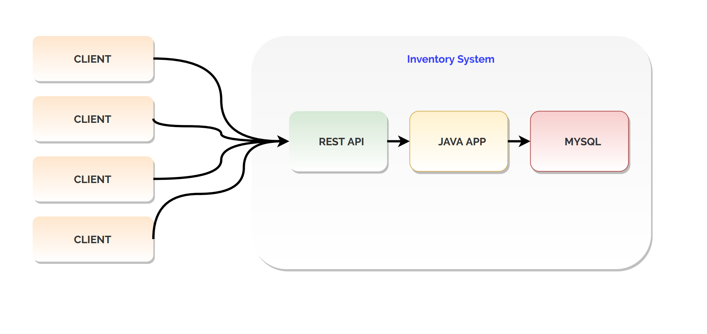

#  Java Inventory 

---
##  Tabla de contenidos


- [Introduccíon](#Introducción)
- [About](#About )
- [Arquitectura](#Arquitectura)
- [Instalación](#instalación)
- [Características](#Características)
- [Team](#team)


---

 
## Introducción

-  🇬🇧 ENG - The main goal of this project is to work with the best development practices. 
The idea for the application is develop an Inventory Sales Stores Server, in which will be many basic inventory functionalities for a clothing store. 
The focus will be on practices like: Good coding style, CI (Continuous Integration) planing and making improvements through automated testing. 
Technologies like JUnit, Maven and others will be used in the development. It will be great to end this project, deploying it in a EC2 AWS instance to bring its 
services to any client.
              
  - 🇪🇸 ESP - El objetivo principal de este proyecto es el uso de buenas prácticas de programación para el desarrollo de una aplicación usando JAVA, que servirá 
  para el inventario de una tienda  de ropa. Esta app contará con las funcionalidades básicas de un inventario para el negocio.
 Se prestará atención en las buenas prácticas para el estilo de codificación, integración continua, planing de desarrollo,
  testeo automático, etc.  El proyecto finaliza mediante el despliegue de la aplicación en un servicio cloud de AWS (EC2) 
  para hacer uso de los servicios de la aplicación mediante algún cliente y acceder a las funcionalidades de la aplicación.
 
---
 ## About

  -  This project is being developed by [Jhosef A. Cardich Palma](https://www.linkedin.com/in/jhosef-anderson-cardich-palma-74765788/). This is a project developed in JAVA. The goal is the deployment of the application in a EC2 (AWS Instance) to serve any client all the operations available in a store inventory.


 ---
## Arquitectura

La implementación general se ha seguido un patrón ***Modelo Vista Controlador (MVC)*** , para definir los componentes y sus interacciones. 
Let's take a look how this architecture looks like:

 ***Organización del proyecto***
- Se cuenta con una aplicación Java,una base de datos SQL, y algún cliente a desarrollarse. 
> Esta es una primera version de lo que podría ser 
 


## Instalación

 - El proyecto se iniciara mediante [Maven](https://maven.apache.org/) para la organización de las dependencias y JUnit para testeo.

 #### Configuración Entorno
-  Se usa el entorno de desarrollo Intellij IDEA.

 - Configurar Maven con Intellij IDEA. 
> Instalación Maven
```
$ Maven installation ... 
 ```

- En el acrhivo 'pom.xml' agregar las siguientes configuraciones para JUnit:

> Contenido de 'pom.xml'
```
<?xml version="1.0" encoding="UTF-8"?>
<project xmlns="http://maven.apache.org/POM/4.0.0"
         xmlns:xsi="http://www.w3.org/2001/XMLSchema-instance"
         xsi:schemaLocation="http://maven.apache.org/POM/4.0.0 http://maven.apache.org/xsd/maven-4.0.0.xsd">
    <modelVersion>4.0.0</modelVersion>

    <groupId>com.jhosefcardichpalma.java</groupId>
    <artifactId>inventory-system</artifactId>
    <version>1.0-SNAPSHOT</version>
    <name>inventory-system</name>

    <properties>
        <maven.compiler.target>11</maven.compiler.target>
        <maven.compiler.source>11</maven.compiler.source>
        <junit.jupiter.version>5.4.2</junit.jupiter.version>
    </properties>

    <dependencies>
        <dependency>
            <groupId>org.junit.jupiter</groupId>
            <artifactId>junit-jupiter-api</artifactId>
            <version>${junit.jupiter.version}</version>
            <scope>test</scope> <!--indicates where this dependency's libraries will be added in the final distributable deployment-->
            <!--so, the test scope is not gonna be included in the final package.-->
        </dependency>
        <!--The engine is gonna do all the tests, running the asserts or-->
        <!--${junit.jupiter.version} coge el valor de las properties-->
        <dependency>
            <groupId>org.junit.jupiter</groupId>
            <artifactId>junit-jupiter-engine</artifactId>
            <version>${junit.jupiter.version}</version>
            <scope>test</scope>
        </dependency>
    </dependencies>

</project>
 ```
---
 

## Características

La aplicación permite realizar las siguientes operaciones contra una base de datos de ejemplo: 


#### Carrito de la compra 
- Se puede diseñar alguna especie de carrito de la compra, para la sesión de un cliente en el que se puede llevar la compra actual, checkeando la disponibilidad del producto.

````
- Agregar un articulo al carrito.
- Quitar un producto de carrito.
- Terminar la sesión de compra.
````

#### Borrado, Añadir, Medias de Ventas , Listado 
- Algunas de las operaciones más basicas que se pueden encontrar en una aplicación de inventario sobre una base de datos.

> Los siguientes operaciones están disponibles:

````
- Listado de los productos disponibles de la tienda.
- Borrado de productos: Venta, no existencias.
- Media de Ventas: Numero de unidades de un producto vendido.

````

## Dependencias

Los siguientes paquetes de software son necesarios en el sistema para poder hacer funcional la aplicación:
- [Java 11](https://www.oracle.com/es/java/)
- [Maven](https://maven.apache.org/)
- [JUnit](https://junit.org/junit5/)


## Team
> Contributors/People

| <a href="https://www.linkedin.com/in/jhosef-anderson-cardich-palma-74765788/" target="_blank">**Jhosef A. Cardich Palma**</a> | 
| :---: |
|  <a href="https://www.linkedin.com/in/jhosef-anderson-cardich-palma-74765788/" target="_blank"></a>   |
|***Full-Stack Software Developer***|
| Linkedin:   <a href="https://www.linkedin.com/in/jhosef-anderson-cardich-palma-74765788/" target="_blank">` Jhosef A. Cardich Palma`</a>| 
| Twitter: <a href="http://twitter.com/jhosefcardich" target="_blank">`@JhosefCardich`</a>| 
|Instagram: <a href="http://instagram.com/arts_hot" target="_blank">`@ARTS-HOT`</a>


---


