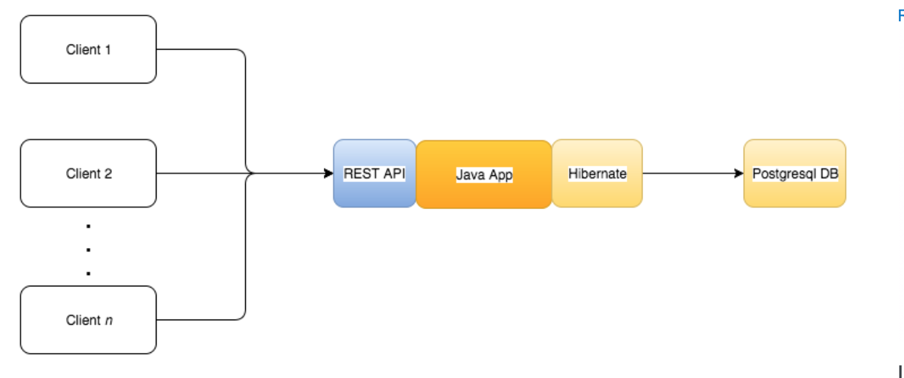

#  Java Inventory 

---
##  Tabla de contenidos


- [Introduccíon](#Introducción)
- [About](#About )
- [Arquitectura](#Arquitectura)
- [Instalación](#instalación)
- [Características](#Características)
- [Team](#team)


---

 
## Introducción

-  🇬🇧 ENG - This is a project developed in JAVA. The goal is the deployment of the application in a EC2 (AWS Instance) to serve any client all the operations available in a store inventory.

  - 🇪🇸 ESP -  El proyecto finaliza mediante el despliegue de la aplicación en un servicio cloud de AWS (EC2) para hacer uso de los servicios de la aplicación mendiante algún cliente y acceder a las funcionalidades de la aplicación.

---
 ## About

  - 🇬🇧The main goal of this project is the use of good practices to develop a JAVA application. The idea is to develop a Inventory Sales Stores, in which will be many basic inventory funcionalities for a clothing store. The focus will be on practices like: Good coding style, CI (Continuous Intergration) planing and making improvements through automated testing. Technologies like JUnit, Maven and others will be used in the development.
   This project is being developed by [Jhosef A. Cardich Palma](https://www.linkedin.com/in/jhosef-anderson-cardich-palma-74765788/). 

---
  - 🇪🇸 El objetivo principal de este proyecto es el uso de buenas prácticas de programación para el desarrollo de una aplicación usando JAV, que servira para el inventario de una tienda  de ropa. Esta app contará con las funcionalidades basicas de un inventario de productos.
   Se prestará atención en las buenas prácticas para el estilo de codificación, integración conitnua, planing de desarrollo, testeo automático, etc.   Este proyecto esta siendo desarrollado por [Jhosef A. Cardich Palma](https://www.linkedin.com/in/jhosef-anderson-cardich-palma-74765788/).


 ---
## Arquitectura

La implementación general se ha seguido un patrón ***Modelo Vista Controlador (MVC)*** , para definir los componentes y sus interacciones. 
Let's take a look how this architecture looks like:

 ***Organización del proyecto***
- Se cuenta con una base de datos en SQL, una aplicación Java, y algun cliente a desarrollarse. 
> Esta es una primera version de lo que podría ser 
 


## Instalación

 - El proyecto se iniciara mediante [Maven](https://maven.apache.org/) para la orgnizacion del testeo y las dependencias.

 #### Configuración Entorno
-  Se usa el entorno de desarrollo Intellij IDEA.

> Instalación Maven
```
$ Maven installation ... 
 ```
 - Configurar Maven con Intellij IDEA. 


---
 

## Características

La aplicación permite realizar las siguientes operaciones contra una base de datos de ejemplo: 


#### Carrito de la compra 
- Se puede diseñar alguna especie de carrito de la compra, para la sesión de un cliente en el que se puede llevar la compra actual, checkeando la disponibilidad del producto.

````
- Agregar un articulo al carrito.
- Quitar un producto de carrito.
- Terminar la sesión de compra.
````

#### Borrado, Añadir, Medias de Ventas , Listado 
- Algunas de las operaciones más basicas que se pueden encontrar en una aplicación de inventario sobre una base de datos.

> Los siguientes operaciones están disponibles:

````
- Listado de los productos disponibles de la tienda.
- Borrado de productos: Venta, no existencias.
- Media de Ventas: Numero de unidades de un producto vendido.

````

## Dependencias

Los siguientes paquetes de software son necesarios en el sistema para poder hacer funcional la aplicación:

- [JUnit](https://junit.org/junit5/)
- [Maven](https://maven.apache.org/)
- [Java 8](https://www.oracle.com/es/java/technologies/javase/javase-jdk8-downloads.html)

## Team
> Contributors/People

| <a href="https://www.linkedin.com/in/jhosef-anderson-cardich-palma-74765788/" target="_blank">**Jhosef A. Cardich Palma**</a> | 
| :---: |
|  <a href="https://www.linkedin.com/in/jhosef-anderson-cardich-palma-74765788/" target="_blank"></a>   |
|***Full-Stack Software Developer***|
| Linkedin:   <a href="https://www.linkedin.com/in/jhosef-anderson-cardich-palma-74765788/" target="_blank">` Jhosef A. Cardich Palma`</a>| 
| Twitter: <a href="http://twitter.com/jhosefcardich" target="_blank">`@JhosefCardich`</a>| 
|Instagram: <a href="http://instagram.com/arts_hot" target="_blank">`@ARTS-HOT`</a>


---


